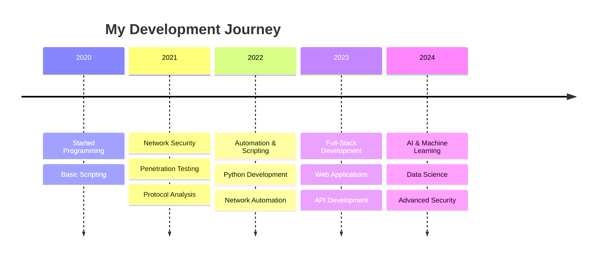

# Md Shahed Fardous

  

  
  
  

 

## About

I'm passionate about **network security**, **automation**, and building solutions that make complex systems simple. Currently focused on advancing cybersecurity practices through code and exploring the intersection of AI and network security.

 

## 🎯 Current Focus

<table>
<tr>
<td>

**🛡️ Security**  
🔍 Network penetration testing  
🔒 Security automation frameworks  
📊 Protocol analysis & monitoring  
🚨 Threat detection systems

</td>
<td>

**🐍 Development**  
⚡ Python for networking  
🤖 Data science & ML pipelines  
🌐 Full-stack applications  
🔗 API development & integration

</td>
<td>

**🔬 Research**  
🧠 Human behavior analysis  
🤖 AI/ML security applications  
📡 Network automation solutions  
☁️ Cloud security architecture

</td>
</tr>
</table>

 

## 💻 Technical Skills

### 🔐 Security & Infrastructure

<picture>
  <source media="(prefers-color-scheme: dark)" srcset="https://img.shields.io/badge/🛡️_Network_Security-FF3B30?style=flat-square&logoColor=white">
  
</picture>
<picture>
  <source media="(prefers-color-scheme: dark)" srcset="https://img.shields.io/badge/🔍_Penetration_Testing-34C759?style=flat-square&logoColor=white">
  
</picture>
<picture>
  <source media="(prefers-color-scheme: dark)" srcset="https://img.shields.io/badge/📡_SDN-5856D6?style=flat-square&logoColor=white">
  
</picture>
<picture>
  <source media="(prefers-color-scheme: dark)" srcset="https://img.shields.io/badge/🚨_Threat_Detection-FF9500?style=flat-square&logoColor=white">
  
</picture>

### 💻 Programming & Development

<picture>
  <source media="(prefers-color-scheme: dark)" srcset="https://img.shields.io/badge/Python-3776AB?style=flat-square&logo=python&logoColor=white">
  
</picture>
<picture>
  <source media="(prefers-color-scheme: dark)" srcset="https://img.shields.io/badge/JavaScript-F7DF1E?style=flat-square&logo=javascript&logoColor=black">
  
</picture>
<picture>
  <source media="(prefers-color-scheme: dark)" srcset="https://img.shields.io/badge/PHP-777BB4?style=flat-square&logo=php&logoColor=white">
  
</picture>
<picture>
  <source media="(prefers-color-scheme: dark)" srcset="https://img.shields.io/badge/Bash-4EAA25?style=flat-square&logo=gnu-bash&logoColor=white">
  
</picture>
<picture>
  <source media="(prefers-color-scheme: dark)" srcset="https://img.shields.io/badge/Perl-39457E?style=flat-square&logo=perl&logoColor=white">
  
</picture>

### 🌐 Web Technologies

<picture>
  <source media="(prefers-color-scheme: dark)" srcset="https://img.shields.io/badge/Next.js-000000?style=flat-square&logo=nextdotjs&logoColor=white">
  
</picture>
<picture>
  <source media="(prefers-color-scheme: dark)" srcset="https://img.shields.io/badge/React-61DAFB?style=flat-square&logo=react&logoColor=black">
  
</picture>
<picture>
  <source media="(prefers-color-scheme: dark)" srcset="https://img.shields.io/badge/WordPress-21759B?style=flat-square&logo=wordpress&logoColor=white">
  
</picture>
<picture>
  <source media="(prefers-color-scheme: dark)" srcset="https://img.shields.io/badge/jQuery-0769AD?style=flat-square&logo=jquery&logoColor=white">
  
</picture>

### 🗄️ Databases & Cloud

<picture>
  <source media="(prefers-color-scheme: dark)" srcset="https://img.shields.io/badge/MySQL-4479A1?style=flat-square&logo=mysql&logoColor=white">
  
</picture>
<picture>
  <source media="(prefers-color-scheme: dark)" srcset="https://img.shields.io/badge/PostgreSQL-336791?style=flat-square&logo=postgresql&logoColor=white">
  
</picture>
<picture>
  <source media="(prefers-color-scheme: dark)" srcset="https://img.shields.io/badge/MongoDB-47A248?style=flat-square&logo=mongodb&logoColor=white">
  
</picture>
<picture>
  <source media="(prefers-color-scheme: dark)" srcset="https://img.shields.io/badge/☁️_Cloud_Architecture-007AFF?style=flat-square&logoColor=white">
  
</picture>

### 🤖 AI & Data Science

<picture>
  <source media="(prefers-color-scheme: dark)" srcset="https://img.shields.io/badge/TensorFlow-FF6F00?style=flat-square&logo=tensorflow&logoColor=white">
  
</picture>
<picture>
  <source media="(prefers-color-scheme: dark)" srcset="https://img.shields.io/badge/scikit--learn-F7931E?style=flat-square&logo=scikit-learn&logoColor=white">
  
</picture>
<picture>
  <source media="(prefers-color-scheme: dark)" srcset="https://img.shields.io/badge/Pandas-150458?style=flat-square&logo=pandas&logoColor=white">
  
</picture>
<picture>
  <source media="(prefers-color-scheme: dark)" srcset="https://img.shields.io/badge/NumPy-013243?style=flat-square&logo=numpy&logoColor=white">
  
</picture>

### 🛠️ Tools & Automation

<picture>
  <source media="(prefers-color-scheme: dark)" srcset="https://img.shields.io/badge/🔧_Google_Apps_Script-4285F4?style=flat-square&logo=google&logoColor=white">
  
</picture>
<picture>
  <source media="(prefers-color-scheme: dark)" srcset="https://img.shields.io/badge/Git-F05032?style=flat-square&logo=git&logoColor=white">
  
</picture>
<picture>
  <source media="(prefers-color-scheme: dark)" srcset="https://img.shields.io/badge/Docker-2496ED?style=flat-square&logo=docker&logoColor=white">
  
</picture>
<picture>
  <source media="(prefers-color-scheme: dark)" srcset="https://img.shields.io/badge/⚡_Automation_Scripts-FF9500?style=flat-square&logoColor=white">
  
</picture>

### 💼 Enterprise Systems

<picture>
  <source media="(prefers-color-scheme: dark)" srcset="https://img.shields.io/badge/🖥️_Windows_Server-0078D4?style=flat-square&logo=windows&logoColor=white">
  
</picture>
<picture>
  <source media="(prefers-color-scheme: dark)" srcset="https://img.shields.io/badge/🐧_Linux_Administration-FCC624?style=flat-square&logo=linux&logoColor=black">
  
</picture>
<picture>
  <source media="(prefers-color-scheme: dark)" srcset="https://img.shields.io/badge/📊_VBA_Excel-217346?style=flat-square&logo=microsoft-excel&logoColor=white">
  
</picture>
<picture>
  <source media="(prefers-color-scheme: dark)" srcset="https://img.shields.io/badge/🔄_VBS_Scripting-5C2D91?style=flat-square&logoColor=white">
  
</picture>

 

## Featured Projects

| Project | Description | Tech Stack |
|---------|-------------|------------|
| **[WhoisThere](https://github.com/shahedfardous/WhoisThere)** | Network discovery & device identification | Python, Networking |
| **[Video Player](https://github.com/shahedfardous/browser-based-video-player)** | Modern HTML5 video player | TypeScript, NextJs |
| **[Git Cheat Sheet](https://github.com/shahedfardous/gitCheatSheet)** | Comprehensive Git reference | Documentation |
| **[Static IP Tool](https://github.com/shahedfardous/staticIP)** | Network configuration utility | Shell, Networking |
| **[YTP Downloader](https://github.com/shahedfardous/ytp-downloader)** | Media download utility | Python |

 

## GitHub Analytics

  
   
  
   
  

## Development Journey

 

---

**Let's connect and build something amazing together**

  
  
  

